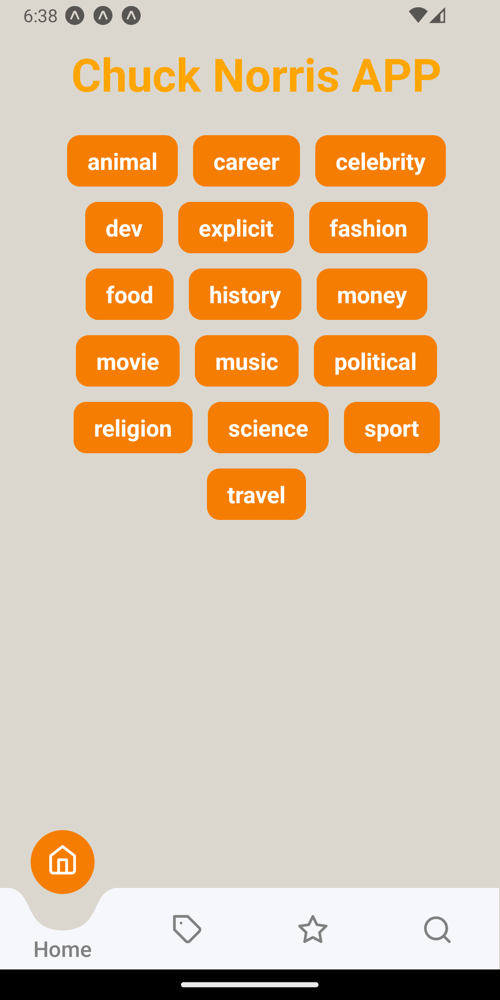
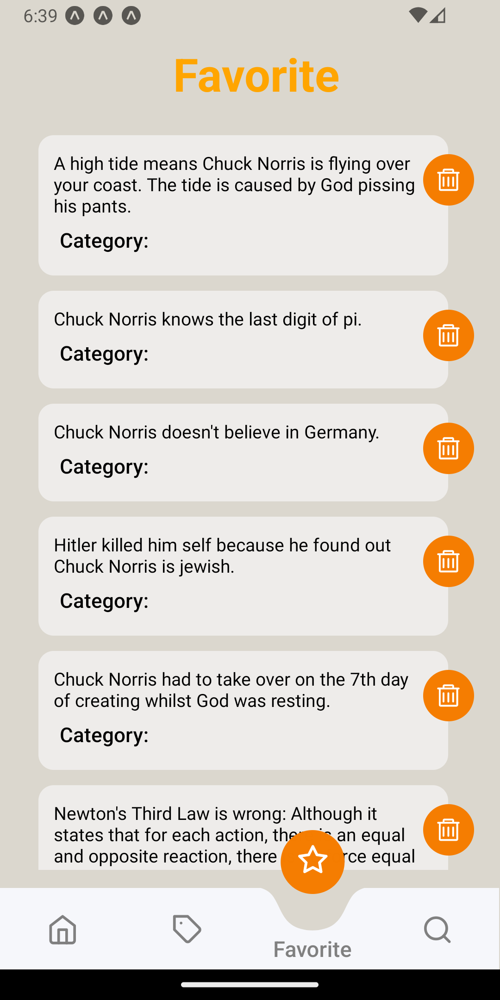
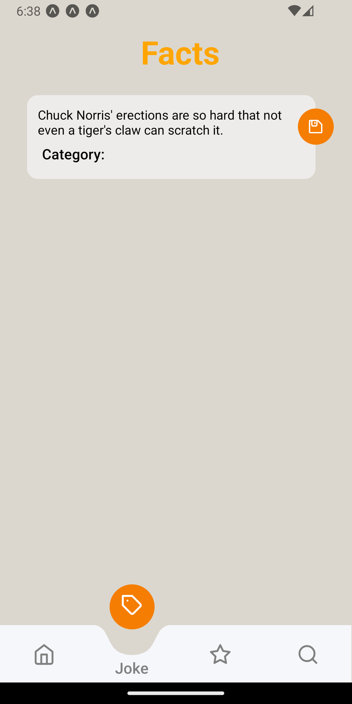

# Technical Test: React Native Developer

## Table of Contents

- [Technical Test: React Native Developer](#technical-test-react-native-developer)
  - [Table of Contents](#table-of-contents)
  - [Description](#description)
  - [Requirements](#requirements)
  - [Installation / How to run](#installation--how-to-run)
  - [Environment Variables](#environment-variables)
  - [Screen description](#screen-description)
  - [Screenshots](#screenshots)
  - [Project Structure](#project-structure)
  - [Stack, Libraries, and Tools](#stack-libraries-and-tools)

## Description

This project is a technical test for a React Native Developer position.

The main project is currently on the main branch.

And n the 'development-fix-animate-navbar' branch, there's a test version of the improved navbar if you want to check it out. It fixes the bug of the tab change caused by an internal link; the change is now made by updating a variable instead of triggering an event.

## Requirements

- Node: v20.16.0
- Npm: 10.8.1
- Android Studio: 2024.1.2
- Virtual device: Pixel 3 API 33 Android 13.0('Tiramisu') | x86_64

## Installation / How to run

1. Install dependencies

   ```bash
   npm install
   ```

2. Create a .env and add firebase auth env

3. Start the app

   ```bash
    npx expo start
   ```

## Environment Variables

The environment variables are located in the `.env` file. The following environment variables are required:

- `EXPO_PUBLIC_API_KEY`: Configuring Firebase Authentication
- `EXPO_PUBLIC_AUTH_DOMAIN`: Configuring Firebase Authentication
- `EXPO_PUBLIC_PROJECT_ID`: Configuring Firebase Authentication
- `EXPO_PUBLIC_STORAGE_BUCKET`: Configuring Firebase Authentication
- `EXPO_PUBLIC_MESSAGING_SENDER_ID`: Configuring Firebase Authentication
- `EXPO_PUBLIC_APP_IP`: Configuring Firebase Authentication

## Screen description

## Screenshots

- `/Login`: You can login


- `/Signup`: You can create account


- `/Home`: Principal sreen, you can select the category of joke. (Protected)



- `/Favorite`: Show all of the favorite jokes. (Protected)



- `/Joke`: Show the joke of the catorogy you select in Home Screen. (Protected)



- `/Search`: Search jokes. (Protected)


## Project Structure

```bash
THECHUCKNORRISAPP/
│
├── .expo/
├── .husky/
├── .vscode/
├── android/
├── src/
│   ├── App.tsx
│   ├── assets/
│   ├── components/
│   ├── config/
│   ├── constants/
│   ├── context/
│   ├── hooks/
│   ├── lib/
│   ├── models/
│   ├── Screens/
│   └── store/
├── .commitlintrc.json
├── .env
├── .env.example
├── .gitignore
├── .prettierignore
├── .prettierrc
├── app.json
├── eslint.config.mjs
├── expo-env.d.ts
├── index.ts
├── package.json
├── README.md
└── tsconfig.json
```

## Stack, Libraries, and Tools

This project uses the following stack:

- Library: [React Native](https://reactnative.dev/)
- Framework: [Expo](https://docs.expo.dev/)
- Language: [TypeScript](https://www.typescriptlang.org/)
- State management: [Zustand](https://zustand-demo.pmnd.rs/)
- Form validation: [React Hook Form](https://react-hook-form.com/)
- Schema declaration and validation: [Zod](https://zod.dev/)
- Auth: [Firebase Authentication](https://firebase.google.com/products/auth)
- Routing and Navigation: [React Navigation](https://reactnavigation.org/)
- Shader: [d3-shape](https://d3js.org/d3-shape)
- Linting: [ESLint](https://eslint.org/)
- Formatting: [Prettier](https://prettier.io/)
- Version Control: [Git](https://git-scm.com/)
- Git hooks: [Husky](https://typicode.github.io/husky/)
- Lint commit messages: [Commitlint](https://commitlint.js.org/)
- Repository Hosting: [GitHub](https://github.com/)
- Data fetching: [Axios](https://axios-http.com/docs/intro)
